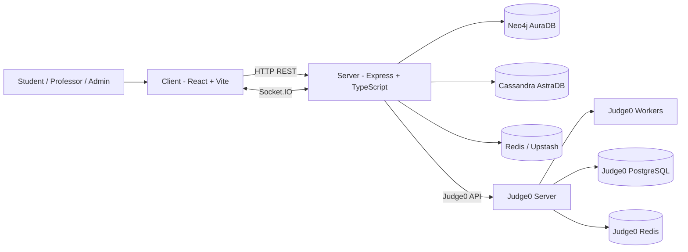
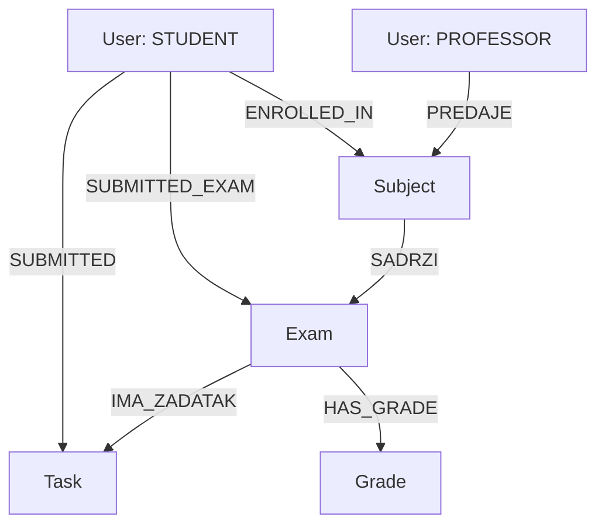

# Assessly

University project for the **Advanced Databases** course.  
Assessly is an online exam system with:
- subject/exam/task management,
- in-browser coding editor,
- real-time proctoring signals,
- student-professor chat,
- auto/manual submission,
- grading and review.

---

## 1) Start with script (recommended)

Use the PowerShell script in project root: `assessly_start.ps1`.

### Prerequisites
- Docker Desktop (WSL2 backend enabled)
- PowerShell 5+ or PowerShell 7+
- `server/.env` must exist (`server/.env.example` can be used as template)
- valid Cassandra secure bundle file referenced by `CASSANDRA_BUNDLE_PATH`

### Start without Judge0 (local C++ only)
```powershell
.\assessly_start.ps1
```

### Start with Judge0
```powershell
.\assessly_start.ps1 -WithJudge0
```

### If PowerShell blocks script execution
```powershell
Set-ExecutionPolicy -Scope Process Bypass
```

### What the script does
- verifies `server/.env` and `docker-compose.yml`
- validates `CASSANDRA_BUNDLE_PATH` from `server/.env`
- in `-WithJudge0` mode pulls the configured Judge0 image
- uses `docker compose` v2 (or falls back to `docker-compose`)
- without `-WithJudge0`:
  - starts only `server` and `client`
  - overrides Judge0 env variables to empty values (server runs in local C++ mode)
- with `-WithJudge0` starts full compose stack

---

## 2) Start without script

### A) With Judge0
From project root:
```powershell
docker compose up -d --build
```

Open:
- Client: http://localhost:5173
- Server: http://localhost:3000
- Judge0 API: http://localhost:2358

### B) Without Judge0 (local C++ only)

Option 1 (simple):
1. Set `JUDGE0_BASE_URL=` (empty) in `server/.env`
2. Start app services only:
```powershell
docker compose up -d --build server client
```

Option 2 (no `.env` edits):
- create a temporary compose override file that clears Judge0 env vars on `server`
- start:
```powershell
docker compose -f docker-compose.yml -f <override-file>.yml up -d --build server client
```

---

## 3) Stack overview

### Frontend
- React 19 + TypeScript
- Vite
- Tailwind CSS 4
- Monaco editor
- Socket.IO client

### Backend
- Node.js + Express 5 + TypeScript
- Socket.IO
- JWT + bcrypt
- Zod validation
- Multer (task PDF upload)

### Code execution
- Judge0 (optional, multi-language)
- local C++ runner fallback (`g++`, no sandbox)

---

## 4) Databases and responsibilities

### Neo4j (AuraDB) - core domain graph

Main nodes:
- `User`
- `Subject`
- `Exam`
- `Task`
- `Grade`

Main relationships:
- `(:User)-[:PREDAJE]->(:Subject)`
- `(:Subject)-[:SADRZI]->(:Exam)`
- `(:Exam)-[:IMA_ZADATAK]->(:Task)`
- `(:User)-[:ENROLLED_IN]->(:Subject)`
- `(:User)-[:SUBMITTED]->(:Task)`
- `(:User)-[:SUBMITTED_EXAM]->(:Exam)`
- `(:Exam)-[:HAS_GRADE]->(:Grade)`

Additional potential use:
- recommendation paths,
- suspicious behavior graph analysis,
- advanced relationship analytics.

### Cassandra (Astra DB) - logs, audit, communication

Used tables:
- `execution_logs`
- `security_events`
- `user_activity`
- `exam_comments`
- `exam_chat_messages`

Additional potential use:
- long-term analytics,
- anti-cheat time-series heuristics,
- audit export / retention workflows.

### Redis - real-time runtime state

Used for:
- exam runtime status/timers,
- active session flags,
- withdraw/started student markers,
- online status and violation counters.

Examples:
- `exam:{examId}:status`
- `exam:{examId}:start_time`
- `exam:{examId}:end_time`
- `exam:{examId}:remaining_ms`
- `exam:{examId}:session_id`
- `user:status:{userId}`
- `user:violations:{examId}:{userId}`

Additional potential use:
- cache layer for dashboards,
- global rate limits,
- distributed locks for critical operations.

### Judge0 internal storage (when enabled)

In `docker-compose.yml` Judge0 includes:
- `judge0-db` (PostgreSQL)
- `judge0-redis`

These are used internally by Judge0 submission pipeline; not directly by Assessly business logic.

---

## 5) Architecture diagram (Mermaid)



## 6) Neo4j relation diagram (Mermaid)



---

## 7) Useful Docker commands

Start:
```powershell
docker compose up -d --build
```

Stop:
```powershell
docker compose down
```

Rebuild server only:
```powershell
docker compose up -d --build server
```
