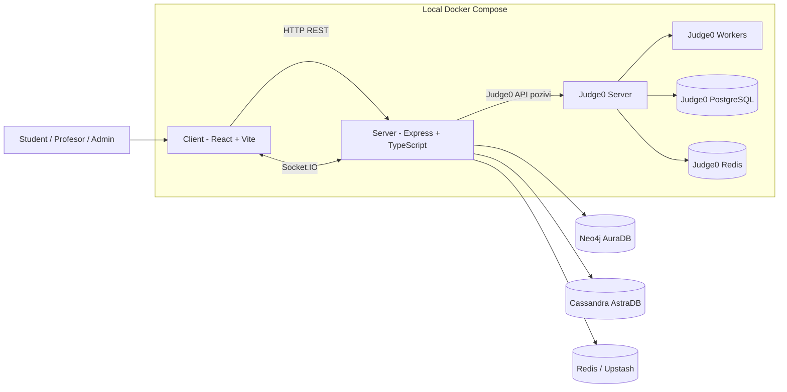
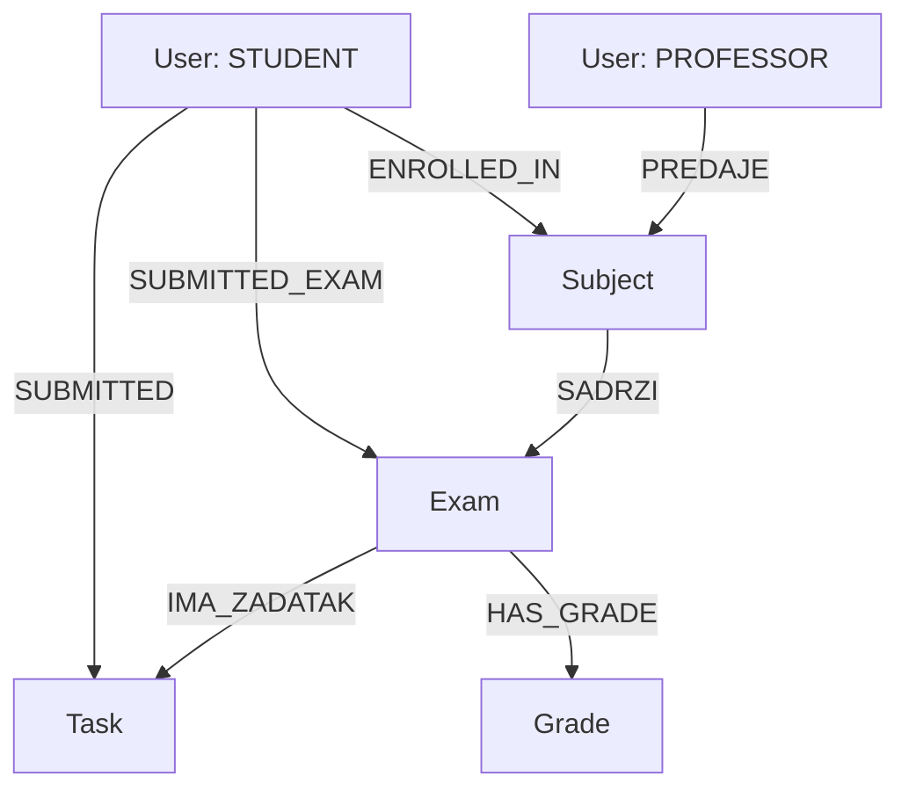

# Assessly

Fakultetski projekat iz predmeta **Napredne baze podataka**.  
Sistem za online ispite: kreiranje predmeta/ispita/zadataka, rešavanje zadataka u editoru, real-time nadzor, chat student-profesor, automatsko i ručno submitovanje, logovanje aktivnosti i ocenjivanje.

---

## 1) Kako pokrenuti projekat (preko skripte)

Najbrži način je PowerShell skripta u root-u projekta: `assessly_start.ps1`.

### Preduslovi
- Docker Desktop (WSL2 backend uključen)
- PowerShell 5+ ili PowerShell 7+
- `server/.env` mora postojati (koristi `server/.env.example` kao šablon)
- validan Cassandra secure bundle fajl na putanji iz `CASSANDRA_BUNDLE_PATH`

### Pokretanje bez Judge0 (samo lokalni C++ runner)
```powershell
.\assessly_start.ps1
```

### Pokretanje sa Judge0
```powershell
.\assessly_start.ps1 -WithJudge0
```

### Ako PowerShell blokira skriptu
```powershell
Set-ExecutionPolicy -Scope Process Bypass
```

### Šta skripta radi (sažetak)
- proverava da postoje `server/.env` i `docker-compose.yml`
- čita i validira `CASSANDRA_BUNDLE_PATH` iz `server/.env`
- u `-WithJudge0` režimu povlači odgovarajuću Judge0 sliku
- bira `docker compose` (v2) ili fallback na `docker-compose`
- bez `-WithJudge0`:
  - pokreće samo `server` i `client`
  - privremeno override-uje Judge0 env varijable na prazno (da backend radi u local C++ modu)
- sa `-WithJudge0` pokreće ceo stack iz compose fajla

---

## 2) Pokretanje bez skripte

### A) Sa Judge0
Iz root foldera:
```powershell
docker compose up -d --build
```

Otvoriti:
- Client: http://localhost:5173
- Server: http://localhost:3000
- Judge0 API: http://localhost:2358

### B) Bez Judge0 (samo lokalni C++)

**Opcija 1 (najjednostavnije):**
1. U `server/.env` postavi `JUDGE0_BASE_URL=` (prazno).
2. Pokreni samo app servise:
```powershell
docker compose up -d --build server client
```

**Opcija 2 (bez izmene `.env`):**
napravi privremeni override compose fajl koji prazni Judge0 env varijable za `server`, pa pokreni:
```powershell
docker compose -f docker-compose.yml -f <override-file>.yml up -d --build server client
```

---

## 3) Tehnologije i uloga

### Frontend
- **React 19 + TypeScript**: SPA klijent
- **Vite**: dev server i build
- **Tailwind CSS 4**: UI stilovi
- **Monaco editor**: kod editor na Exam stranici
- **Socket.IO client**: real-time događaji (timer, status ispita, chat, upozorenja)

### Backend
- **Node.js + Express 5 + TypeScript**
- **Socket.IO**: real-time exam state, monitoring i chat
- **JWT + bcrypt**: autentikacija/autorizacija i hash lozinki
- **Zod**: validacija request-a
- **Multer**: upload PDF zadataka

### Izvršavanje koda
- **Judge0** (opciono): više programskih jezika
- **Local C++ runner** (fallback): `g++` kompilacija + pokretanje bez sandbox-a

---

## 4) Baze podataka: gde i kako se koriste

Projekt koristi više baza, svaka za svoju specifičnu ulogu.

### 4.1 Neo4j (AuraDB) - glavna poslovna domen logika

Koristi se za relacije između korisnika, predmeta, ispita, zadataka, predaja i ocena.

**Glavni entiteti (čvorovi):**
- `User`
- `Subject`
- `Exam`
- `Task`
- `Grade`

**Glavne relacije:**
- `(:User)-[:PREDAJE]->(:Subject)` (profesor predaje predmet)
- `(:Subject)-[:SADRZI]->(:Exam)` (predmet sadrži ispit)
- `(:Exam)-[:IMA_ZADATAK]->(:Task)` (ispit ima zadatke)
- `(:User)-[:ENROLLED_IN]->(:Subject)` (student upisan na predmet)
- `(:User)-[:SUBMITTED]->(:Task)` (kod/output po zadatku)
- `(:User)-[:SUBMITTED_EXAM]->(:Exam)` (finalna predaja ispita)
- `(:Exam)-[:HAS_GRADE]->(:Grade)` (ocena po studentu)

**Napomena:** pri startu servera se osigurava fulltext indeks nad `User.email`.

**Potencijalne dodatne upotrebe Neo4j:**
- preporuke zadataka po uspešnosti i istoriji
- detekcija sličnosti ponašanja/grupa tokom ispita
- napredna analitika nad graf relacijama student-predmet-zadatak

### 4.2 Cassandra (Astra DB) - logovi, audit i komunikacija

Koristi se za vremenski orijentisane događaje i veće količine zapisa.

**Tabele koje backend koristi:**
- `execution_logs` (run/save izvršavanja koda)
- `security_events` (tab switch, blur, copy/paste i sl.)
- `user_activity` (aktivnosti korisnika/admin-a)
- `exam_comments` (komentari profesora po studentu/liniji koda)
- `exam_chat_messages` (chat poruke i odgovori profesora)

**Potencijalne dodatne upotrebe Cassandre:**
- dugoročna analitika po ispitu/studentu
- anti-cheat heuristike zasnovane na vremenskim serijama događaja
- retention politike i eksport audit trail-a

### 4.3 Redis - real-time state i ephemeral podaci

Koristi se za privremeno stanje ispita i brzu sinkronizaciju preko Socket.IO.

**Primeri ključeva/podataka:**
- status/timer ispita:  
  - `exam:{examId}:status`
  - `exam:{examId}:start_time`
  - `exam:{examId}:end_time`
  - `exam:{examId}:remaining_ms`
  - `exam:{examId}:duration_seconds`
- sesije i state studenata:
  - `exam:{examId}:session_id`
  - `exam:{examId}:started_students`
  - `exam:{examId}:started:{studentId}`
  - `exam:{examId}:withdrawn:{studentId}`
- online status i violation brojači:
  - `user:status:{userId}`
  - `user:violations:{examId}:{userId}`

**Potencijalne dodatne upotrebe Redis-a:**
- globalni rate-limit i session blacklist
- kratkorošni cache često čitanih dashboard agregata
- distributed lock za kritične operacije (npr. start/restart ispita)

### 4.4 Judge0 interne baze (kada je Judge0 uključen)

U `docker-compose.yml` Judge0 dolazi sa internim servisima:
- `judge0-db` (PostgreSQL)
- `judge0-redis`

Te baze koristi **Judge0 interno** za queue/submission pipeline; aplikacija ih ne koristi direktno kroz svoj kod.

---

## 5) Korisni Docker komandni set

Pokretanje:
```powershell
docker compose up -d --build
```

Gašenje:
```powershell
docker compose down
```

Rebuild samo servera (posle izmene `.env` ili backend koda):
```powershell
docker compose up -d --build server
```

---

## 6) Troubleshooting

- Judge0 problemi:
  - proveri da li Docker Desktop koristi WSL2
  - restartuj stack:
  ```powershell
  docker compose down
  docker compose up -d --build
  ```

- Portovi zauzeti:
  - oslobodi `3000`, `5173`, `2358`

- Skripta javlja da Cassandra bundle ne postoji:
  - proveri `CASSANDRA_BUNDLE_PATH` u `server/.env`
  - putanja može biti apsolutna ili relativna u odnosu na `server/`

---

## 7) Arhitektura sistema (Mermaid)



Brzi recap:
- Frontend radi UI + editor + real-time events.
- Backend drzi domensku logiku, auth, validaciju, websocket tokove i orchestraciju run/submission procesa.
- Neo4j drzi relacione domenske podatke.
- Cassandra drzi logove/audit/chat/komentare.
- Redis drzi runtime stanje ispita i online/violation signalizaciju.
- Judge0 (ako je ukljucen) radi sandbox izvrsenje za vise jezika.

---

## 8) Neo4j model (vizuelno)



Najvazniji "business flow":
- Profesor kreira Subject -> Exam -> Task.
- Student se upisuje na Subject i dobija pristup ispitu.
- Student radi zadatke i cuva predaje po Task-u.
- Na kraju predaje ceo ispit (`SUBMITTED_EXAM`), profesor upisuje ocenu (`Grade`).

---

## 9) English documentation

English version is available in `README.en.md`.
